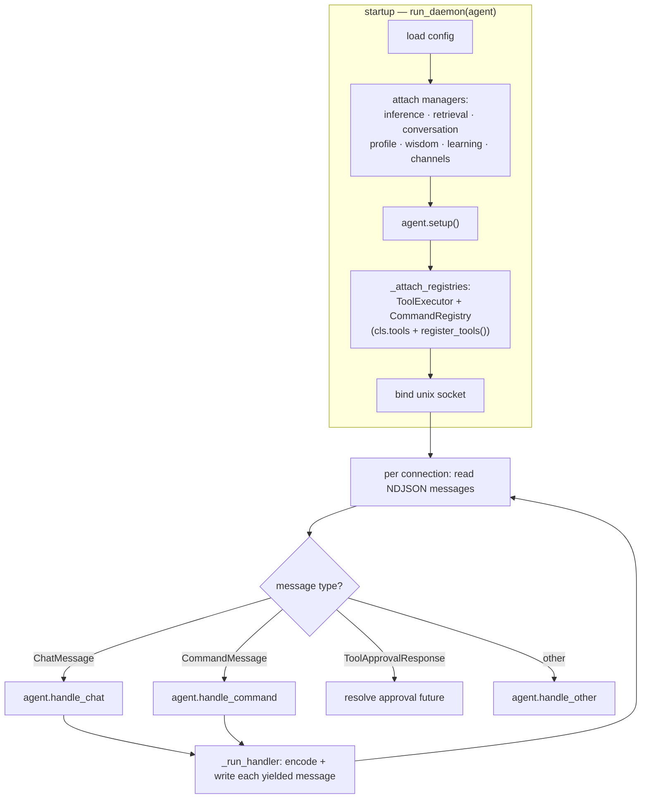
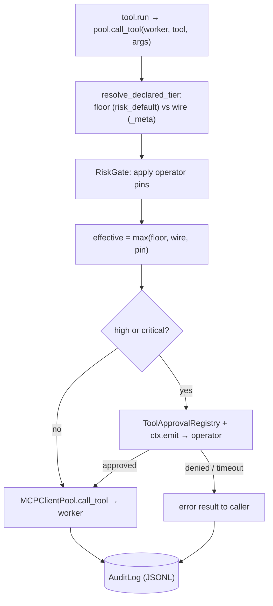

# agent_core

Shared library for the agent ecosystem. Provides the daemon runtime, socket
protocol, inference client, retrieval, wisdom, learning, channels, scratchpad,
fetcher/chunker/converter, CLI REPL, an opt-in Discord gateway adapter, and an
**MCP worker layer** with risk-gated tool dispatch + audit. Agents subclass
`Agent`, implement a few handlers, and get the rest for free.

## Status

Extracted from PAL and in active use. Current line: **v1.6.0** (per-tool risk
tiers advertised over the MCP wire). Two consumers: **PAL** (knowledge agent) and
**PARE** (RE-lab agent). Original design:
`docs/superpowers/specs/2026-04-25-agent-core-extraction-design.md` in the PAL repo.

## Architecture

An agent is a thin subclass of `Agent`. `run_daemon` wires the framework managers
onto it, builds the tool/command registries, binds a Unix socket, and dispatches
each incoming message to the agent's handlers. The handlers `yield` messages; the
daemon encodes and streams them back to the client.



### Worker discovery

MCP workers are declared in `workers.yaml`. At startup `discover_and_register`
connects each worker, lists its tools (capturing per-tool risk tiers from MCP
`_meta`), and synthesizes a `Tool` subclass per tool that dispatches back through
the pool. An unreachable worker is logged and skipped — the agent still starts.

```mermaid
flowchart LR
    YAML["workers.yaml"] --> REG["WorkerRegistry.load"]
    REG --> SPECS["WorkerSpec list"]
    SPECS --> DAR["discover_and_register(specs, pool)"]
    DAR --> LT["per worker: pool.list_tools"]
    LT --> MCP["MCPClientPool → stdio / streamable_http worker"]
    MCP -->|"tool defs + _meta risk tiers"| MTC["make_tool_class"]
    MTC --> TC["Tool subclasses"]
    TC --> TE["ToolExecutor (LLM-facing schemas)"]
```



### Risk-gated dispatch

Every worker tool call flows through `RiskAwareToolPool`. It resolves an effective
risk tier — the **max** of the worker's `risk_default` floor, the per-tool tier
advertised over the wire, and any operator pin in `workers.yaml` — gates
high/critical calls on operator approval (delivered over the connection via
`ctx.emit`), and audits every dispatch to a JSONL log.



## Installation

Private repo, install via git:

```bash
pip install "agent_core @ git+https://github.com/EdibleTuber/agent_core.git@v0.1.1"
```

For development against a local checkout:

```bash
pip install -e /path/to/agent_core
```

## Building an agent

Subclass `agent_core.agent.Agent` and implement the handlers the daemon dispatches to.

**At minimum you must implement `handle_chat`** — it is the per-turn loop (call the
model, stream the reply, dispatch tool calls). The base class is a bare
`raise NotImplementedError`, so an agent that implements only
`setup`/`system_prompt`/`register_tools` will boot fine, register its tools, and serve
its socket — then fail on the **first chat message** with an empty `NotImplementedError`.
Don't get caught by this (PARE did).

Overrides:

- `handle_chat(self, msg, ctx) -> AsyncIterator[object]` — **required to converse.** Yield
  `StreamChunkMessage` / `ResponseMessage` / `ErrorMessage` / `ToolProgressMessage`. Use
  `agent_core.inference.InferenceClient` (`.stream()` / `.complete()`, with tool-call
  support) to talk to your model, and dispatch any tool calls through your tool pool so they
  are risk-gated + audited.
- `system_prompt(self, ctx) -> str` — **required** (also `NotImplementedError` in the base).
- `handle_command(self, msg, ctx)` — implement if you accept `/commands` (also a stub).
- `setup(self)` — optional; construct domain resources (framework managers are already populated).
- `register_tools(self)` — optional; return tool classes (e.g. from `discover_and_register`)
  to expose MCP workers.

The terminal REPL (`agent_core.adapters.cli.run_repl`) is a **library, not an entry point**.
Each agent ships its own launcher that calls `run_repl(config.socket_path, renderer)` with a
`Renderer` (two methods: `splash()` and `format_message()`).

### Gotchas

- **Worker discovery isn't resilient to unreachable workers (as of v1.6.0).**
  `discover_and_register` runs workers sequentially; an unreachable `streamable_http` worker's
  cancellation can cascade and cancel *sibling* workers' discovery, and closing clients logs a
  noisy but harmless anyio "cancel scope" traceback. If a healthy worker isn't registering,
  check whether an unreachable worker precedes it in the registry. Fix tracked for a later release.

## Tests

```bash
pip install -e ".[dev]"
pytest
```
